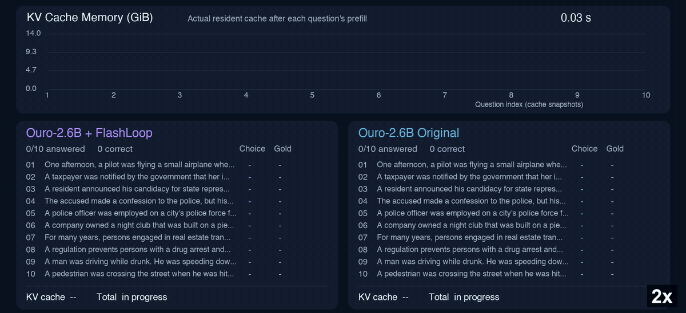
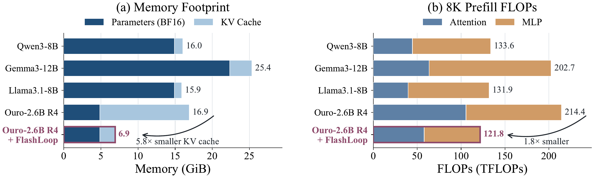

<div align="center">
  <h1>FlashLoop</h1>
  <p><strong>Fast and Memory-Efficient Looped Transformers via Lazy Updates</strong></p>
  <p>A training-free inference framework that reduces cross-loop redundancy through token-sparse updates, sparse attention, and KV-residual quantization.</p>

  <p>
    <a href="https://arxiv.org/abs/2609.29812"></a>
    <a href="https://superone77.github.io/FlashLoop/"></a>
    <a href="https://pypi.org/project/flashloop/"></a>
    <a href="LICENSE"></a>
  </p>
</div>

<p align="center">
  <a href="#overview">Overview</a> ·
  <a href="#installation">Installation</a> ·
  <a href="#quick-start">Quick start</a> ·
  <a href="#implementations">Implementations</a> ·
  <a href="#citation">Citation</a>
</p>

<p align="center">
  
</p>

---

## Overview

Looped Transformers reduce model size by repeatedly applying a shared set of layers, but parameter sharing does not translate into proportional gains in inference efficiency. FlashLoop exploits **cross-loop redundancy** to reduce computation and KV-cache memory without retraining.

| Lazy update | What it does |
| :--- | :--- |
| **Token-sparse updates** | Reuse converged token states across loops. |
| **Loop-aware sparse attention** | Focus late-loop attention on important keys. |
| **KV-residual quantization** | Compress the differences between adjacent loops' KV caches. |

Across the evaluated Looped Transformer variants, FlashLoop achieves **up to 1.64× end-to-end speedup** and **up to 6× KV-cache memory reduction**. The figure below compares the memory footprint and 8K prefill FLOPs of Ouro-2.6B R4 before and after FlashLoop.

<p align="center">
  
</p>

<p align="center"><em>Ouro-2.6B R4: 16.9 → 6.9 GiB memory footprint and 214.4 → 121.8 TFLOPs for 8K prefill.</em></p>

## Installation

FlashLoop targets **Linux with an NVIDIA CUDA GPU** and **Python 3.10+**. Install a CUDA-compatible PyTorch build for your system first. The optimized engine also needs a CUDA toolkit (`nvcc`) and a compatible C++ compiler to build its default KIVI reader. The package pins `transformers==4.56.2`.

```bash
python -m pip install flashloop
flashloop-build-kernels
```

For development from a checkout, run `python -m pip install -e .` and then `flashloop-build-kernels`. The PyTorch reference implementation does not require FlashLoop's CUDA extension.

## Quick start

Use a trusted official Ouro checkpoint. The optimized engine exposes a small Python API:

```python
from transformers import AutoTokenizer
from flashloop import FlashLoopEngine

model_path = "/path/to/Ouro-1.4B"
tokenizer = AutoTokenizer.from_pretrained(model_path, trust_remote_code=True)
input_ids = tokenizer.apply_chat_template(
    [{"role": "user", "content": "What is the capital of France?"}],
    tokenize=True,
    add_generation_prompt=True,
    return_tensors="pt",
).cuda()

engine = FlashLoopEngine.from_pretrained(model_path)
output_ids = engine.generate(input_ids, max_new_tokens=64)
print(tokenizer.decode(output_ids[0, input_ids.shape[1]:], skip_special_tokens=True))
```

From a repository checkout, the shared example can run either backend:

```bash
python examples/generate.py --backend engine --model /path/to/Ouro-1.4B \
  --prompt "What is the capital of France?" --max-new-tokens 64

python examples/generate.py --backend torch --model /path/to/Ouro-1.4B \
  --prompt "What is the capital of France?" --max-new-tokens 64
```

<details>
<summary>PyTorch reference API</summary>

The reference backend uses a fresh hook context for each request:

```python
import torch
from transformers import AutoModelForCausalLM, AutoTokenizer
from flashloop_torch import flashloop

model_path = "/path/to/Ouro-1.4B"
tokenizer = AutoTokenizer.from_pretrained(model_path, trust_remote_code=True)
input_ids = tokenizer.apply_chat_template(
    [{"role": "user", "content": "What is the capital of France?"}],
    tokenize=True, add_generation_prompt=True, return_tensors="pt",
).cuda()
model = AutoModelForCausalLM.from_pretrained(
    model_path,
    trust_remote_code=True,
    torch_dtype=torch.bfloat16,
    attn_implementation="eager",
).cuda().eval()

with torch.inference_mode(), flashloop(model) as hooks:
    output_ids = model.generate(input_ids, max_new_tokens=64,
                                do_sample=False, use_cache=True)
    audit = {name: hook.audit() for name, hook in hooks.items()}
```

</details>

## Implementations

| Package | Intended use | KV representation |
| :--- | :--- | :--- |
| [`flashloop`](flashloop/) | Optimized CUDA inference | Physically packed int4 cache with custom readers |
| [`flashloop_torch`](flashloop_torch/) | Readable algorithm reference and quality experiments | Fake quantization with materialized tensors |

The defaults use four loops: dense loops 1–2, 25%/10% token retention in loops 3–4, 10% key retention for sparse late-loop decode, 4-bit K/V with group size 64, and a 64-token BF16 residual tail.

## Repository layout

```text
flashloop/              Optimized execution, packed cache, CUDA kernels
flashloop_torch/        Reference API and internal algorithm implementations
examples/generate.py   Shared real-generation example
scripts/               Kernel build and two-backend smoke commands
tests/                 CPU-safe repository checks
docs/                  Project page and media
```

Run `bash scripts/smoke_test.sh /path/to/Ouro-1.4B` from a checkout to save actual outputs from both backends. For CPU-safe repository checks, install `.[test]` and run `python -m pytest`; GPU inference still needs a separate check. No model weights, evaluation datasets, cluster credentials, private logs, or artificial-delay demonstrations are included.

## Citation

If you use FlashLoop in research, please cite the [paper](https://arxiv.org/abs/2609.29812):

```bibtex
@misc{yang2026flashloop,
  title={FlashLoop: Fast and Memory-Efficient Looped Transformers via Lazy Updates},
  author={Wanqi Yang and Shiwei Liu},
  year={2026},
  eprint={2609.29812},
  archivePrefix={arXiv},
  primaryClass={cs.LG},
  url={https://arxiv.org/abs/2609.29812}
}
```

## License

Project code is released under the [MIT License](LICENSE). Third-party notices, including KIVI attribution, are preserved in [THIRD_PARTY_NOTICES.md](THIRD_PARTY_NOTICES.md). Model checkpoints and external dependencies retain their own terms.
